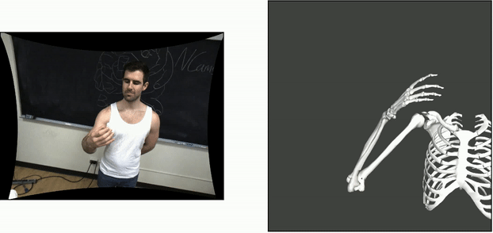
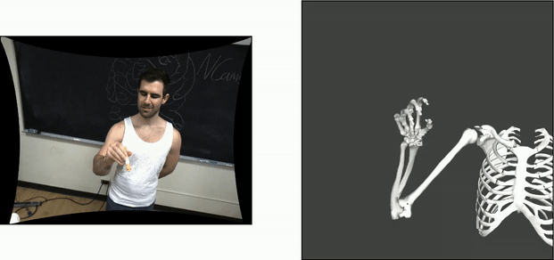
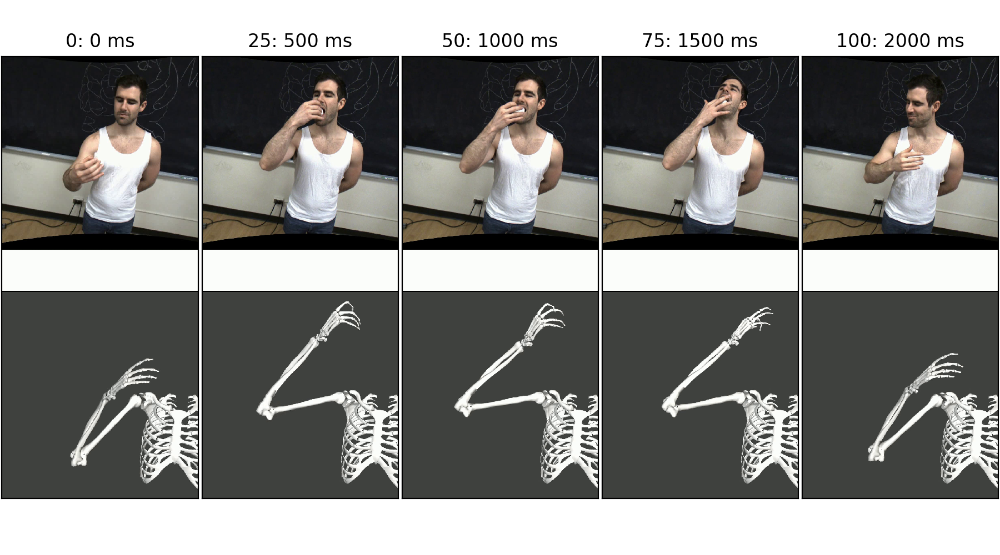

# NCams

NCams is a toolbox to use multiple cameras to track and reconstruct the kinematics of primate limbs. NCams leverages state-of-the-art machine learning approaches for image tracking ([DeepLabCut](http://www.mousemotorlab.org/deeplabcut)) and musculoskeletal modeling ([OpenSIM](https://simtk-confluence.stanford.edu:8443/display/OpenSim/OpenSim+Documentation)) and includes integration and processing software specifically developed for primate limb tracking.

NCams is installed as a Pythron module with several submodules that include camera calibration, estimation of relative camera positions, triangulation of the marker information from multiple cameras. The module runs on Windows or *nix.

  
   

## Features
1. Intrinsic camera calibration - any number of cameras can be quickly calibrated with support for checkerboard or charucoboards. 

2. Extrinsic calibration/camera pose estimation - multiple methods for calculating the camera extrinsics are available (one-shot, stereo-sequential, and common-point)

3. Quantification of both intrinsic and extrinsic calibrations.
4. Multiple triangulation/3D reconstruction methods inculding processing/filtering.
5. Inverse kinematics...

## Getting Started

This project's code is available on [GitHub](https://github.com/CMGreenspon/NCams). The example raw data is available on [Dropbox](https://www.dropbox.com/sh/lrc2sik1kxlujgi/AACBH2y36wfbjzUre85rEl4ea) and raw images on [Box](https://uchicago.app.box.com/s/glgee9o0katg9cvr7t5tjeygne3rs9on).

### Prerequisites

Software:
- [Python 3+/Anaconda](https://www.anaconda.com/products/individual)
- [DeepLabCut](https://github.com/AlexEMG/DeepLabCut/blob/master/docs/installation.md) - if using it for labeling markers. See below for installation recommendations.
    - [NVIDIA drivers](https://www.nvidia.com/download/index.aspx)
    - [CUDA 10.0](https://developer.nvidia.com/cuda-downloads)
- [Spinnaker Python module](https://flir.app.boxcn.net/v/SpinnakerSDK/folder/68522911814) if using FLIR cameras for capture.
- [OpenSim 4.0](https://simtk.org/frs/index.php?group_id=91#package_id319) to calculate inverse kinematics.
- Module dependencies are listed in the [setup](setup.py) file.

If you have problems with installations, check out our [installation tips](documentation/installation.md).

There are no hardware prerequisites for the core functionality of the toolbox. If using DeepLabCut or the spinnaker_tools, however, then an NVIDIA videocard that supports CUDA or FLIR cameras are required resspectively.

## Installation

1. Download the [repository](https://github.com/CMGreenspon/NCams) or clone it using git: `git clone https://github.com/CMGreenspon/NCams.git`.
2. Open Terminal, or Command Line or the desired Anaconda environment (e.g. the one with DeepLabCut installed) in the project folder.
3. Run `python setup.py install`.

### Calibration and pose estimation

[Example with capturing data](Examples/example_with_recording_data.py) contains example code for setting up multiple FLIR cameras, calibration of lenses, estimation of their poses, and creation of videos from captured images.

[Example with supplied data](Examples/example_with_supplied_data.py) can help you calibrate the lenses on the cameras, estimate their poses, and create of videos. The data to run the code on is stored on [Dropbox](https://www.dropbox.com/sh/lrc2sik1kxlujgi/AACBH2y36wfbjzUre85rEl4ea) and [Box](https://uchicago.app.box.com/s/glgee9o0katg9cvr7t5tjeygne3rs9on).

### Labeling and 3D marker reconstruction

The [analysis](Examples/analysis.py) goes over marking images with DeepLabCut, training a network and triangulation of the marker data.

[Analysis of multiple sessions](Examples/analysis_multiple_sessions.py) follows the analysis example, but is specifically designed to handle multiple sessions of recordings from the same cameras.

[Tips](documentation/tips.md) have suggestions on NCams/DeepLabCut use that can be useful.

### Inverse kinematics

The [guide](Examples/inverse_kinematic_guide.py) describes the necessary tools and steps to obtain joint angles of a skeletal model that follow the measured markers using OpenSim (SimTK). We use a [publically available skeletal model](??? not yet) of the human right arm and hand that we [modified](opensim_models) and markered to fit our purposes.

## Structure of the repository

- [ncams](ncams) -- imported module
- [Examples](Examples) -- examples and guides on using NCams
- [documentation](documentation) -- various documentation on NCams
- [opensim_models](opensim_models) -- OpenSim skeletal models that we use for inverse kinematics
- [dlc_markers](dlc_markers) -- images with location of markers relatively to bone segments and a DLC config with marker names and skeleton
- [images](images) -- demonstrational images and gifs

## Authors

- [**Charles M. Greenspon**](https://github.com/CMGreenspon)
- [**Anton Sobinov**](https://github.com/nishbo)
- Developed in [Bensmaia Lab](http://bensmaialab.org/).
